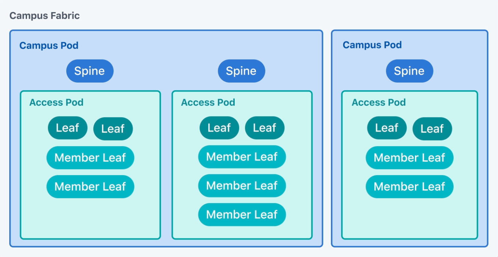

---
# This title is used for search results
title: Generate Cloudvision Tags with eos_designs - Preview
---
<!--
  ~ Copyright (c) 2023-2025 Arista Networks, Inc.
  ~ Use of this source code is governed by the Apache License 2.0
  ~ that can be found in the LICENSE file.
  -->

# Generate CloudVision Tags - Preview

!!! warning

    The generation of CloudVision Tags in the `eos_designs` role is in preview mode.

    Everything is subject to change, is not supported and may not be complete.

    If you have any questions, please leverage the GitHub [discussions board](https://github.com/aristanetworks/avd/discussions)

`arista.avd.eos_designs` can generate CloudVision Tags that can be applied to interfaces and/or devices. These tags can be used on CloudVision for during Topology view generation,
or used in searches/filters to select devices based on tags values.

## Available Input Variables

--8<--
/docs/tables/cloudvision-tags.md
--8<--

## CloudVision Topology Tags

`arista.avd.eos_designs` can generate CloudVision Tags that assist CloudVision with rendering the Topology correctly.
It will attempt to generate what are called 'hints' for the following fields. These are picked up from the fabric variables if they are defined.

To enable generation of Topology Tags:

```yaml
generate_cv_tags:
  topology_hints: true
```

| Hint Tag Name              | Description                                                                           | Source of information                                                           |
| -------------------------- | ------------------------------------------------------------------------------------- | ------------------------------------------------------------------------------- |
| `topology_hint_type`       | Indicates whether the node is a leaf, spine, core device etc.                         | `cv_tags_topology_type` if set, else `node_type_keys.[].cv_tags_topology_type`. |
| `topology_hint_fabric`     | The overall fabric that the devices pertains to. Useful for multi-fabric deployments. | `fabric_name`                                                                   |
| `topology_hint_datacenter` | The datacenter to which the devices belongs. Helpful for multi-dc deployments.        | `dc_name`                                                                       |
| `topology_hint_pod`        | The pod to which the devices belongs.                                                 | `pod_name`                                                                      |
| `topology_hint_rack`       | The physical rack in which the device is located.                                     | `rack` defined on `node` or `node_group`                                        |

### CloudVision Topology Tags for Campus deployments

`arista.avd.eos_designs` can generate CloudVision Tags that assist CloudVision with rendering the Campus Topologies.
This specific usecase is required to support Hybrid workflow of managing Campus fabrics with both AVD and CloudVision Studious where:

- AVD is leveraged to build the fabric, deploy network services and infrastructure-related endpoints (firewalls, routers, access points, etc)
- Access Interface Configuration Studio (including it's Quick Actions sub-feature) is leveraged for day 2 operations to configure port profiles and ports using CloudVision UI.

Both `generate_cv_tags.topology_hints` an `generate_cv_tags.campus_fabric` must be set to `true` to globally enable generation of the Campus Topology tags:

```yaml
generate_cv_tags:
  topology_hints: true
  campus_fabric: true
```

Once generation of the Campus Topology tags is globally enabled - assign the following variables to all targeted Campus devices:

- `node_type_keys.[].campus` or `campus`
- `node_type_keys.[].campus_pod` or `campus_pod`
- `node_type_keys.[].campus_access_pod` if set, else `campus_access_pod` ("Campus Access Pod" should not be assigned to Spines)



Example (only relevant configuration is shown):

```yaml
# Spine Switches
l3spine:
  defaults:
    campus: AVD_CAMPUS
    campus_pod: BUILDING_A

# IDF - Leaf Switches
l2leaf:
  defaults:
    campus: AVD_CAMPUS
    campus_pod: BUILDING_A
  node_groups:
    - group: IDF1
      campus_access_pod: IDF1
      nodes:
        - name: LEAF1A
        - name: LEAF1B
    - group: IDF3_AGG
      nodes:
        - name: LEAF3A
          campus_access_pod: IDF3
        - name: LEAF3B
          campus_access_pod: IDF3
    - group: IDF3_3C
      campus_access_pod: IDF3
```

Providing these input variable will lead to the automatic generation of the following Campus-related CloudVision Tags:

| Campus Tag Name             | Tag type  | Description                                                            | Source of information                                                           |
| --------------------------- | --------- | ---------------------------------------------------------------------- | ------------------------------------------------------------------------------- |
| `topology_hint_network_type`| Device    | Identifies associated CloudVision Topology hierarchy type.             | Always set to `campusV2`.                                                       |
| `topology_hint_type`        | Device    | Identifies role of the device in CloudVision Campus Topology.          | `cv_tags_topology_type` if set, else `node_type_keys.[].cv_tags_topology_type`. |
| `Campus`                    | Device    | Identifies Campus fabric.                                              | `node_type_keys.[].campus` if set, else `campus`.                               |
| `Campus-Pod`                | Device    | Identifies Campus pod (spine devices and associated access pods).      | `node_type_keys.[].campus_pod` if set, else `campus_pod`.                       |
| `Access-Pod`                | Device    | Identifies Campus access pod (Leaf and Member-Leaf devices).           | `node_type_keys.[].campus_access_pod` if set, else `campus_access_pod`.         |
| `Link-Type`                 | Interface | Identifies system responsible for managing interface and it's purpose. | `ethernet_interfaces.peer_type`.                                                |

# CloudVision Custom Tags

Custom Tags can have either a static or a dynamic value. Dynamic values come from the `structured_config` generated by `eos_designs`.

Any value that is **not**:

- a list
- a dictionary
- a value in a list

can be defined as the value for a tag. This allows for tags to be generated with values that are calculated for that device. Refer to the example below.

For interfaces, only the `structured_config` for the interface itself is considered.

!!! tip
    Generate the `structured_config` first to get a better idea of what keys are available.

!!! warning
    - Tag names cannot have the name of any existing system tags on CloudVision. System tags cannot be emanded with this approach.
    - If the key specified in `data_path` is not found, the tag is not generated. This avoids having a lot of empty tags.
    - Custom structured configuration will *not* be considered during generation of tags. Only configuration generated by `eos_designs` itself.

To generate custom Tags with a static value:

```yaml
generate_cv_tags:
  device_tags:
    - name: mytag
      value: myvalue
  interface_tags:
    - name: myinterfacetag
      value: myinterfacevalue
```

To generate custom Tags with a dynamic value:

```yaml
generate_cv_tags:
  device_tags:
    - name: mydynamictag
      data_path: router_bgp.as
  interface_tags:
    - name: myinterfacetag
      data_path: peer_type
```
