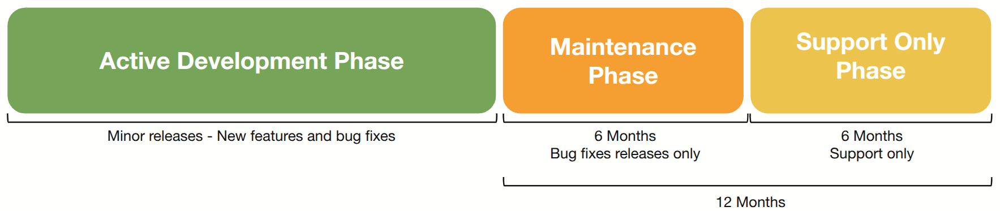
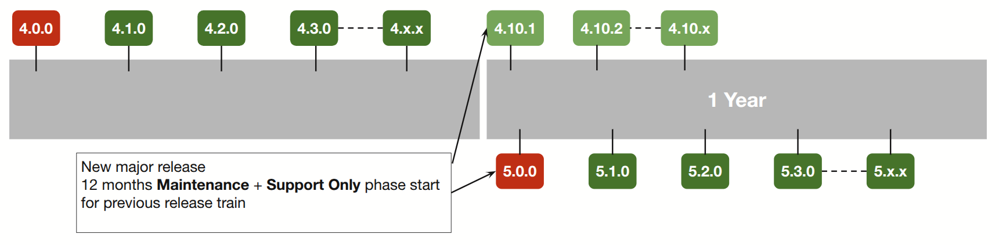

<!--
  ~ Copyright (c) 2025 Arista Networks, Inc.
  ~ Use of this source code is governed by the Apache License 2.0
  ~ that can be found in the LICENSE file.
  -->

# Arista AVD A-Care TAC Support Overview

Arista AVD is a multi-domain network automation framework consumable as code, providing a continuous design framework. The AVD project is offered as an open-source project and backed by the world-class Arista Technical Support team through A-Care Service. TAC support for AVD must be purchased separately; see the ordering information below.

## Support Offering

- AVD software is covered by [A-Care Priority Levels](https://www.arista.com/assets/data/tac/downloads/SRPriorityLevels.pdf).
- TAC support covers software defects and troubleshooting Q&A.
- Provide comprehensive software lifecycle policy for AVD according to the AVD software life cycle policy detailed below.

## Support Scope

### AVD Ansible Collections

- arista.avd
- arista.eos
  - Note: eos_config and eos_command modules only!
- arista.cvp

!!! note
    Note: Red Hat supports “ansible-core” and Ansible Automation Platform. For non-AVD Ansible issues, please contact Red Hat Ansible TAC.

## Software Life Cycle Policy

Arista AVD Software Release Policy and Life Cycle defines the various phases of development and support to guide customers in transitioning to newer versions of the product based on the milestones in the life cycle. Arista Networks will support each major software release train (i.e., **4.**x.x, **5.**x.x) during the **Active Development** phase and up to 12 months after the release enters the **Maintenance** and **Support Only** phase. The following diagram depicts the release phases and the Arista TAC support mapping across this timeline.

### Software Life Cycle

**Active Development Phase:**

- TAC support available.
- Major release with new features, functionality, and bug fixes.

**Maintenance Phase:**

- TAC support available.
- Bug fixes on previous major release.

**Support Only Phase:**

- Ongoing TAC support.
- Software upgrade required for bug fixes.

### Example Release Timeline

The Arista AVD project follows [Semantic Versioning](../versioning/semantic-versioning.md): Major.Minor.Maintenance (ex. 4.10.2):

- Major: Contains breaking changes, follow the [porting guide](../porting-guides/5.x.x.md).
- Minor: New features and fixes (non-breaking).
- Maintenance: Fixes only (non-breaking).

## Ordering Information

| Product Number | Product Description |
| -------------- | ------------------- |
| SVC-AVD-SWITCH-1M | 1-Month A-Care Ansible AVD support for 1 Arista EOS-based Switch. 10G+ Fixed and Modular Platforms. |
| SVC-AVD-G-SWITCH-1M | 1-Month A-Care Ansible AVD support for 1 Arista EOS-based Switch. 1G/mG Fixed and Modular Platforms.|
